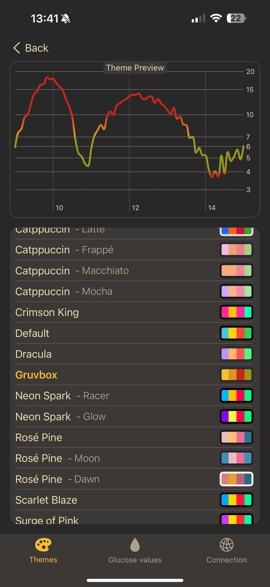
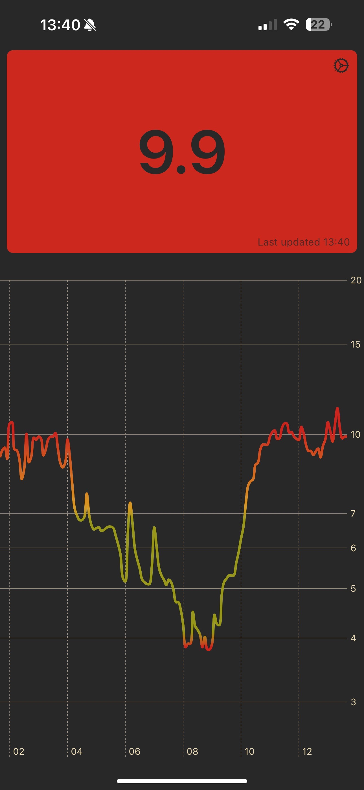

# GlucoScope

GlucoScope is a highly customizable iOS app for diabetics to display track their blood glucose levels and vizualize them with pretty graphs. It's fully compatible with NightScout servers, but can connect a custom Rust server that leverages InfluxDB to store time series data.

## Screenshots

|    |   |  |
|---------------------|---------------------------|-------------------|
